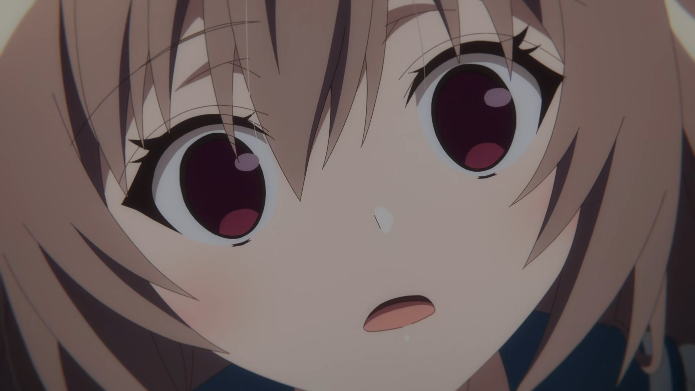
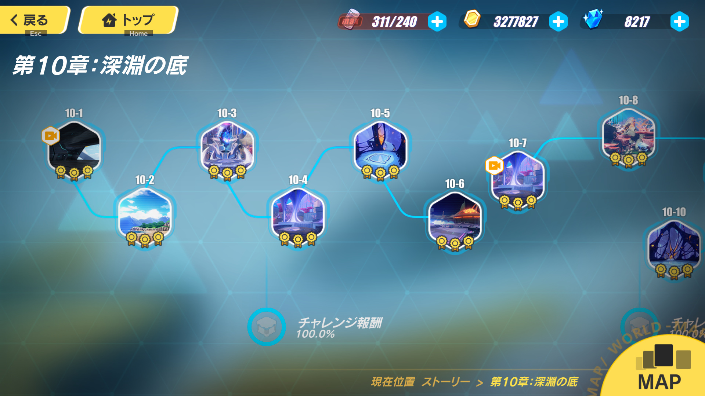
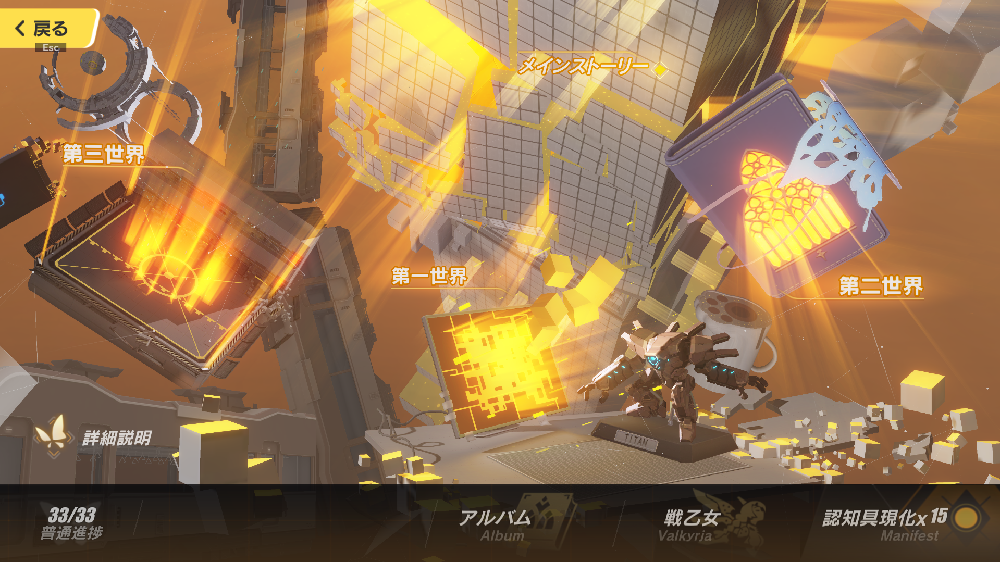
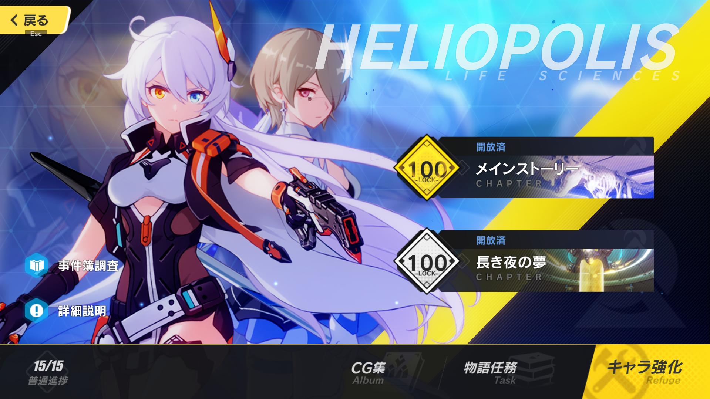
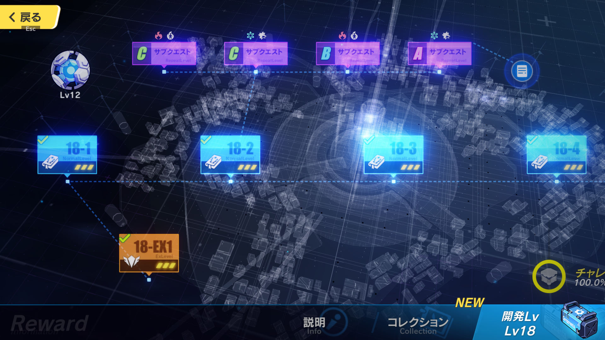
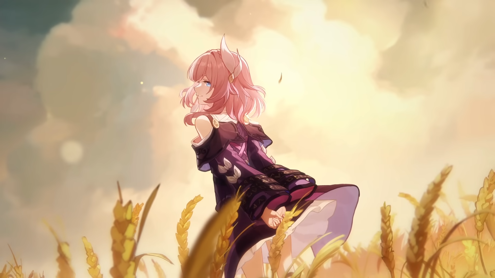
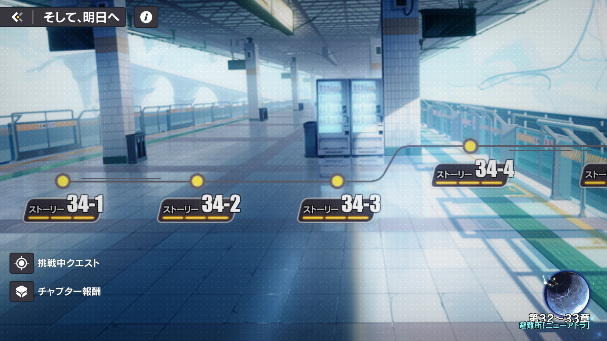
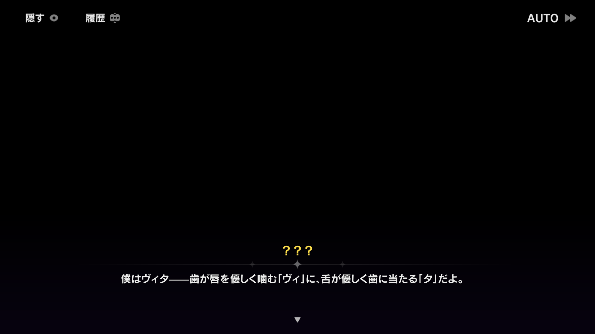
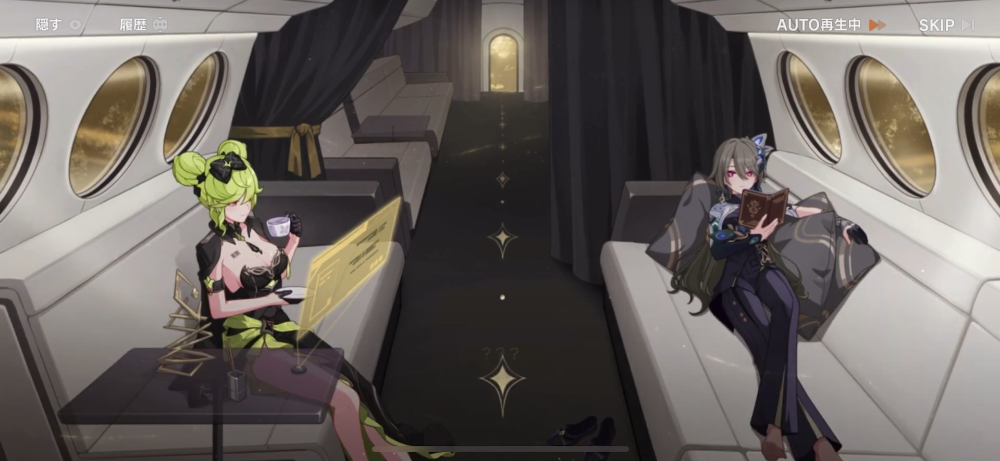
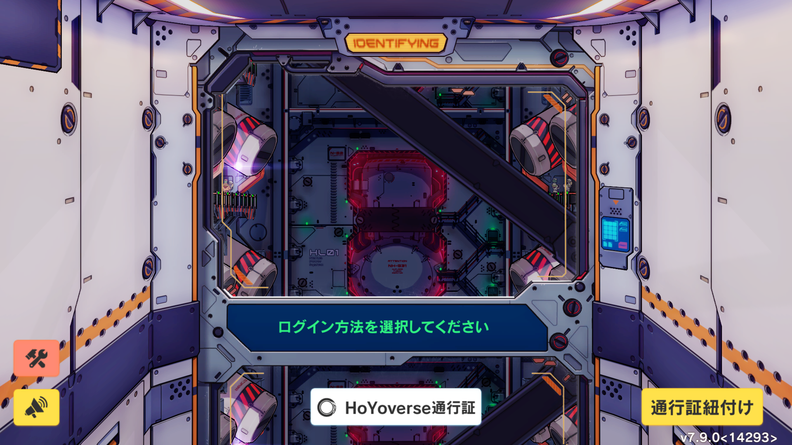

目次
<ul class="table-of-contents">
    <li><a href="#introduction">Introduction</a>
    <li><a href="#story">ストーリー順に振り返る</a><ul>
    <li><a href="#9">9章まで</a></li>
    <li><a href="#ow">オープンワールド</a></li>
    <li><a href="#10-19">第10-19章</a></li>
    <li><a href="#rubia">第20-22章「太虚夢華録」、公式アニメ「渡世」</a></li>
    <li><a href="#moon_halo">第23-25章「そして炎を残した」、公式アニメ「永遠なる薪炎」</a></li>
    <li><a href="#Apocalypse">第26-28章「アポカリプスはこう語った」</a></li>
    <li><a href="#rakuen">古の楽園</a></li>
    <li><a href="#end">終焉を超えた日に</a></li>
    <li><a href="#1.5">第1.5部</a></li>
    <li><a href="#nibu">第二部</a></li>
    </ul>
    <li><a href="#other">その他もろもろ</a><ul>
    <li><a href="#eva">新世紀エヴァンゲリオンの影響</a></li>
    <li><a href="#genshin">原神との関連</a></li>
     
</ul>

いや～～～～～超一大巨編だったな～～～～ーーーー！！！！！！！

2,3月頃にスターレイルがピノコニー編に突入してぼちぼち3rd関連の匂わせが増えてきたのでひっそりと始めた。その前から触れるのは時間の問題なんだろうなと感じてはいたけど。  

<!--more-->
<strong id="Introduction">Introduction</strong>
<blockquote>
崩壊…かつて人類の文明を幾度となく葬ってきた未知の力…今再びこの平和な世界に降臨した。
B.C2000年頃、天変地異によって突如崩壊した人類の文明。 
その後も周期的な氾濫により、人々は文明を築いては崩壊するという歴史を繰り返し歩んできた。 
長きに渡る「崩壊」との戦いは大地を疲弊させ、変異した「崩壊獣」が世界各地に現れ始めた。生き残った人々は、滅亡を回避する為の方法を探ろうと、「天命組織」を設立した。 
その結果、生物の変異から滅亡に至る「崩壊現象」と、対抗する力を備えた「聖痕」の存在が確認された。 
3年前、「第三次崩壊インパクト」と呼ばれる、崩壊史上最大級の災厄がキアナ・カスラナの住んでいる極東の地である長空市に降りかかった。 
崩壊と深い因縁があるカスラナ家の血を継ぐキアナは感染を免れたが、被害は甚大で、人々の心に大きな傷を残すこととなった。 
嘗ての戦いで母を亡くし、父にも失踪されたキアナは、「崩壊」に立ち向かうことを決意し、対崩壊実戦チーム「ヴァルキリー部隊」の戦艦・ハイペリオン号に乗り込んだ。
ーー立ち上がれ！美しい世界を守るために 
miHoYoが贈る新世代の本格スマホアクションゲーム「崩壊3rd」、始動。 
</blockquote>
 

ざっくり言うと、文明の発展に伴って現れる「崩壊」という超自然的現象に立ち向かう少女たちの物語で、miHoYoの前作「崩壊学園」のリメイクです。この「崩壊」という現象にまつわる世界観周辺がやたら込み入っていて、この辺りは「三体」の影響が色濃いのかな。  
ソシャゲという不自由かつ先の見通せない媒体で当初の構想を貫いて6年がかりで描ききったスケール感と人間模様。そしてストーリーの要所要所を気合の入ったアニメーションで描いてくれるのが見どころかな。3Dアクションといいつつ、テキストの比重が異様に高いのでシナリオノベルの形式に思い入れのある自分とは水が合ったね。ここは人によって好み分かれそう。    

あとこの時期のソシャゲで3Dアクションがっつりと取り込んだもので生き残ってるタイトル自体少なくて、スマホのスペック上昇に伴うシステムの変遷とか見て取れるのは面白かった。  

それとストーリーを進め上で声優さんの存在の大きさを感じましたね。メインキャラの声優陣はリリース時の2017年でも到底許されない顔ぶれだけど、実際何十時間もボイスを聴き続ける上で超大御所の安定感って大事だなと改めて身に沁みて思いましたね。  

基本はストーリーに専念、エンドコンテンツ、イベント等には深入りしないという方針でだいたい週一起動くらいのペースでやってきたけど、それでも一年近くかかった。フルボイスなの加味したら多分自分の把握してるソシャゲの中ではぶっちぎりで長い。単純な文字数でfgoやアークナイツといい勝負といったところだろうか。  

崩壊3rdのコンテンツ構造を概観したいなら以下のリンクが参考になるかな。リリースから4年くらいまでスタイルが定まらず3Dアクションとシナリオのバランスに苦心していたのが見どころ。  

 
[【崩壊3rd】メインストーリーと関連コンテンツのおすすめ読破順](https://sttty1022.com/blog/houkai3rd_story/)

運営の空気感込みなら本記事のタイトルにもなったこのスタッフドキュメンタリーも良い。第1部完結に合わせて公開されたものだからネタバレには一切配慮無いけど。  


**その他参考文献**    
[崩壊3rdの舞台設定](https://wikiwiki.jp/houkai/%E5%B4%A9%E5%A3%8A3rd%E3%81%AE%E8%88%9E%E5%8F%B0%E8%A8%AD%E5%AE%9A)

</iframe>

[律者まとめ 崩壊3rd | HoYoLAB](https://www.hoyolab.com/article/7824846)

<iframe 
  class="hatenablogcard" 
  style="width:100%;height:155px;max-width:680px;" 
  title="【律者まとめ】" 
  src="https://hatenablog-parts.com/embed?url=https://www.hoyolab.com/article/7824846" 
  width="300" height="150" frameborder="0" scrolling="no">
</iframe>

  
<strong id="story">ストーリー順に振り返る</strong>  
構造分析的なアプローチと著しく噛み合わせが悪いので無難にプレイした時系列順に振り返っていく。多分こねくり回すより順に振り返った方が早い。  

  
<strong id="9">9章まで</strong>  
巷で9章までやれと言われたから取り敢えず9章までやった。序盤の集大成というよりはここが全ての起点という理解の方が正しいかな。あと5章くらいまで崩壊学園の設定が前提になっていて、ゼロ知識からのチュートリアルとしてはだいぶ厳しいというのもある。    

頑張ればここまで1日でも行ける分量なんだけど、なんとここまでリリース2年かかっている。じゃあそれまで何やってたの？と思って[崩壊3rd編年史](https://wikiwiki.jp/bisyoujo_aji/%E5%B4%A9%E5%A3%8A3rd%E7%B7%A8%E5%B9%B4%E5%8F%B2)見たら番外編のビジュアルノベルやらオープンワールド『桜の輪廻』の実装を行っていた。9章以降は毎バージョン継続的にメインストーリーが更新されるんだけど、このスタイルが確立するまでにも時間がかかっている。  

  
<strong id="ow">オープンワールド</strong>  
オープンワールドではない。番外編兼ウィークリーコンテンツという位置づけで 『桜の輪廻』『天命空港』『後崩壊書』『後崩壊書第二部』の4つがある。  
ステージクリア制というには広すぎるマップを動き回ることができ、オンフィールドで戦闘に加え、ちょっとした探索要素もある。ここまで言えばお分かりだろうが、どこからどう見ても原神のプロトタイプ版です。次回作のテストを本番環境でやるなと苦笑した。  

最初期に実装された『桜の輪廻』は500年前の八重村で妹が酷い目に合わされたショックで発狂する八重様を繰り返し見せつけられる。ちなみに初見の時点ではどこの世界線のいつの時代の話をしているか全く理解していないので悲しきループを呆然と眺めていた。

  

  
<strong id="10-19">第10-19章</strong>  
キアナの放浪やらゼーレの捜索やらで色々話が動く。今回は割愛するけどここらへんはテンポ感が良くてアニメーションも頻繁に見れるので、やってればこの辺のどこかしらで引っかかるものがあるんじゃないかと思う。  
あと章ごとに毎回システムが変わる。ここらへんは自キャラが使えなくてセクション内の独自システムでお試しキャラを強化して使うことになる。    

  

  

  

崩壊3rd公式アニメ「メインストーリーチャプターⅪ Angel Refactoring」  
マーヴィカのバイクのプロトタイプ
  

物語開始時点で行方不明になっていたゼーレの覚醒シーン。今Twitterのアイコンにしてるのは黒ゼーレの方。素の人格がこういう優しい性格の多重人格の女の子、本当に好きなんですよね。元を辿るとコロコロでやってた「ボクらの太陽」のコミカライズに出てくる[アルニカ](https://dic.pixiv.net/a/%E3%82%A2%E3%83%AB%E3%83%8B%E3%82%AB)っていうヒロインに行き着くんだけど、分かる人いるかな。


  
<strong id="rubia">第20-22章「太虚夢華録」、公式アニメ「渡世」</strong>  
識の律者編。フカの肉体にて覚醒した識の律者が暴れまわる様子とフカの回想が同時並行的で進行する。  
委員長の過去が生い立ちから描かれるも、基本的に前文明から現代に至るまで崩壊には負けっぱなしなので、彼女が経験してきた数々の裏切りと挫折、失敗の連続が淡々と描かれる。テキスト以上に暗澹たる気分になる。

前文明、500年前、そして現代とゼロ年代仕草で取り敢えず風呂敷広げた感のあった諸々の設定がすべてここで全部繋がる。長大な時系列を貫く役割を担っているのがフカというキャラなんですよね。  

クライマックスの場面はどこからどう見てもエヴァ破のニアサードインパクトのオマージュなんだけど、わけわからんくらい泣いた。間違いなく今年一番繰り返し再生した。  
腹括って最後までやり切る覚悟を固めたのもここですね。


 
折角だからMVの方も貼っておく。  

  

<strong id="moon_halo">第23-25章「そして炎を残した」、公式アニメ「永遠なる薪炎」</strong>  
今までの騒動が一段落して主要キャラが合流して一時の平穏を過ごす。ゼーレとゼーレがイチャイチャしてるのが眼福だった。  
そこに支配の律者が現れてまたシリアス展開に突入する。ここで一旦物語開始から数えて一つの集大成となる章。  

  

<strong id="Apocalypse">第26-28章「アポカリプスはこう語った」</strong>  
合流前の古の楽園と同時並行で進行したメインストーリー。清々しいまでのCV石田彰の悪役がいるとかでオットー・アポカリプスのことはなぜか以前より知っていた。ゲームやったらなぜか人類側だったんだけど。ということもあって、こいつの結末を見届けるのはだいぶ楽しみにしてた。いつまでHP1で歩くんだよとかちょっと笑ったけど、なんだかんだで最期まで信念貫いてかっこよかったよ。  
  
あとこのセクションで開示された”とある事実”には唸らされたな。特にこれといった匂わせも無かったしよくサービス開始から5年も黙ってられたな。  

キアナも殻を破って、オットーの一件も片付いたしここから物語が佳境に入ると思いきや、ここからあらぬ方向へと展開していく。

  
<strong id="rakuen">古の楽園</strong>   

<blockquote>
<strong><em>これは「英傑」と呼ばれた人々の旅</em></strong> 
<strong><em>十三人の火追者が経験した未完の旅</em></strong> 
<strong><em>けど来訪者 あなたの道は続いてる そうでしょう？</em></strong> 
<strong><em>なら心のままに進みなさい</em></strong> 
<strong><em>足跡を辿って あの火を追った旅を見届けるの</em></strong> 
<strong><em>最後は 死した者たちの墓を越える</em></strong> 
<strong><em>「私たち」が創れなかった未来を 作りなさい</em></strong> 
</blockquote>
  
問題のコンテンツ。前文明の戦士「火を追う十三英傑」との交流を通じ彼ら、彼女らがいかに崩壊に立ち向かい、そして敗れ去ったのかを知る場所。それが古の楽園。ローグライク形式のエンドコンテンツ「古の楽園」と、本編に合流した第29-31章の二部構成となっている。今までメインの数人で回していたところに登場済みキャラ含めて一挙に13人が追加され、この十三英傑を中心とした物語が一年をかけて展開される。この時期を契機に崩壊3rdはテキストADVとしての側面が先鋭化し、シナリオが肥大化していく。  

「古の楽園」では英傑らの記憶体と雷電芽衣の交流を通して、ここまで語られることの無かった前文明の真相がローグライク形式で綴られる。本編に合流した29-31章では、英傑の記憶体が次々と消失し、背後で現文明の律者が関わっていることが判明。疑心暗鬼の中各々が律者に立ち向かう。  
結末を言うと、侵食の律者には古の楽園諸共削除する形で打ち勝つことに成功する。前文明に壊滅的な被害をもたらした侵食の律者に英傑たちは記憶体として仇討ちを果たすが、当時と同じく消滅の運命を辿るという結末で物語は幕を閉じる。  

いくら何でも長すぎだろと思いつつも3ヶ月ほどかけてようやく読み切ったけど、喪失感と爽快感が同居する独特な読後感があって未だにその余韻を引きずっている。というより時が経つほどに印象が強まっている感触さえある。終盤のエリシアとの別れではテキストを進める手がどんどん重くなっていくノベルゲーの感覚が久々に味わえたのもよかった。
  
          
          
          
まあ来年またリベンジマッチやるらしいが  
  

  
<strong id="end">第32章-35章「終焉を超えた日に」</strong>  
第1部完結編。ここまで長かったよ～～。スターレイルとのコラボが発表されて、それが結構本格的なものらしいという噂を聞きつけてしまったので急ピッチで進めた。時間見つけながらゆるゆるやって来年前半くらいまでに現行のストーリーに追いつけばいいかなくらいに思ってたので体力的に本当にしんどかった。頑張れば11月中に二部入れるなと思ってしまったのが運の尽きです。  
ヨルムンガンドの聖痕計画なる計画が発動して、それを今までのストーリーの蓄積を活かして打ち破るという超王道展開。自分は前文明から全てを背負ってきたケビンの方に感情移入しちゃったな。本当にお疲れ様。
でもゲームでこんなにやり切った感あるのいつぶりだろう。ソシャゲばっかやってた一年だけど自分にとっての体験としては崩壊3rdとスターレイル ピノコニー編が二大巨塔になるかな。  

26章-33章はマップ上でストーリーが展開されるオープンワールド形式になるんだけど、最後の最後で初期の形態に戻るのも今までの道のりへのリスペクトが感じれられたな。  

崩壊3rd公式ショートアニメ「卒業旅行」
  

  
<strong id="1.5bu">第1.5部 生と死の踊り</strong>  
第36-39章「海の指先で」と第40-42章「星の彼方で」の二部構成。それぞれ第1部終盤でスポットライトの当たらなかったゼーレとフカがメインに据えられて、本編の固有世界とは異なる場所(世界の泡)に飛ばされた先でその世界の崩壊に立ち向かう。  
ストーリーとしてはケビンとの一件が片付いた後の戦後処理兼エピローグみたいな感じで、ここで6年に及ぶ物語が大団円を迎えたという実感が込み上げてくる。個人的には久々にゼーレの掘り下げがあったのと、フカの方で思わぬ再会を果たしたのが嬉しかった。
自分が始めた頃ちょうど「浮生・渡世の羽」のピックアップが行われてたんだけど、第一部の最後を飾るのがフカっなのは熱いなってまだストーリー進んでないながらも思ったのを覚えている。  

あと今もなおストーリーを引っ掻き回してるこいつが登場するのもこのタイミング。  

  
<strong id="nibu">第二部</strong>    
主人公やメインキャラを一新して舞台を火星に移すということで当時宣伝していたのを覚えている。キアナたちの物語は一旦の完結を見ていると知ったのが始める気になった理由の一つでもあるんですよね。それが蓋を空けてみれば開始30分でこれ↓。二部は今までのストーリー知らなくても全然入っていけますよというという触れ込みだったのは、だいぶだいぶ苦しいのではと呆れ返った。  

  

崩壊世界の火星は地球とは独立に文明を築いていてそこには例のごとく崩壊現象が付随しているんだけど、本来的には同じ現象を説明しているはずなのに大量の新規固有名詞によって全く違う体系であるかのように記述されているので発狂しそうになった。鳴潮さん、チュートリアルの固有名詞オンパレードがしんどいとか言って本当にすみませんでした……  

第2部の構想については未だに全貌が掴めないでいるけど、取り敢えず今は花火が出てきたのがモチベになってる。てか原神みたいな軽いコラボストーリーが出るくらいに思ってたら、コラボ期間に先駆けてがっつりメインストーリーで登場してきたのはマジでビビった。

<strong id="other">その他もろもろ</strong>  

<strong id="eva">新世紀エヴァンゲリオンの影響</strong>  
これはねえ、もうオマージュとか二次創作とかその辺りの言葉では言い尽くせないほどに清々しいまでのエヴァのフォロワーですね。ただえさえ序盤の美術なんてモロにエヴァのそれなのに、やればやるほどこれがエヴァ本編じゃなかったらなんなんですかっている思いが強まっていく。
でも小難しくて鬱屈とした世界観にありながらキアナの愚直なまでに屈さない性格が良くて、本筋自体は王道に仕上がってる。ちゃんと差別化はできてると思うよ。  

  

<strong id="genshin">原神との関連</strong>  
崩壊世界との関連を(現時点では)意図的に断ち切っているのもあって、世界観よりも技術的観点で原神のリリースまでに至るプロセスを感じることが多かったな。  
日本国内だと突然変異的にスマホ対応でリリースされたオープンワールドゲームとして語られがちだけど、崩壊3rdリリース時点でゆくゆくはより広大なオープンワールドをという志を持っていたのは一目瞭然。桜の輪廻の八重村とかモロに稲妻の叩き台だし。章ごとにシステムがコロコロ変わるのも相まってちゃんと段階を踏んで技術的に進歩してきたのが分かる。